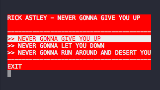

# Terminal Menu

[](https://travis-ci.org/twobucks/terminal-menu)

Retro ANSI terminal menu.




## Install

```
gem install terminal-menu
```

## Example


```ruby
require 'terminal-menu'

menu = TerminalMenu.new(title: 'Rick Astley - Never Gonna Give You Up',
                        description: '',
                        width: 40,
                        fg: 'white',
                        bg: 'red') do |selected|
                          puts "you have selected: #{selected}"
                          menu.quit
                        end

menu.add('Never gonna give you up') do |selected|
  puts "first option selected"
end
menu.add('Never gonna let you down') do |selected|
  puts "second option selected"
end
menu.add('Never gonna run around and desert you') do |selected|
  puts "third option selected"
end
menu.show
```

# API

```ruby
# Initializes new TerminalMenu instance.
# 
# block - Optional block that will get called with label once some option
#         is selected
# 
# Options:
#
#   title - The title of this menu (default: '')
#   description - The description of this menu (default: '')
#   width - The width of this menu in chars (default: 80)
#   fg - Foreground color of this menu (default: 'white')
#   bg - Background color of this menu (default: 'black')
#   stdin - Input IO instance (default: STDIN)
#   stdout - Output IO instance (default: STDOUT)
menu = TerminalMenu.new(title: '', description: '', width: 80,
                        fg: 'white', bg: 'black',
                        stdin: STDIN, stdout: STDOUT){|selected| block }


# Adds a new item to menu options.
#
# label - Label for this menu option.
# blk - Optional block that will be called once this option is selected.
menu.add(label, &blk)

# Starts read-eval-print loop.
menu.show

# Quits this menu.
menu.quit
```

## Thanks

To [@substack](https://github.com/substack) for creating [terminal-menu](https://github.com/substack/terminal-menu) for Node.

## License

MIT
